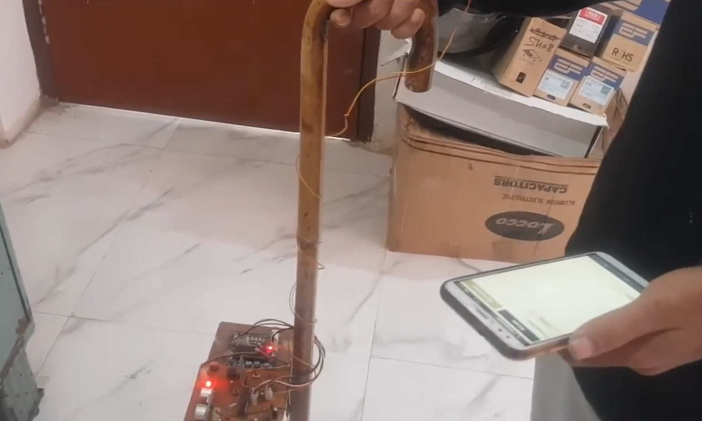

#  Smart Blind Stick (Without GPS)

Final Year Major Project | Department of Computer Science & Engineering  
**DRIEMS University, Cuttack, Odisha**

---

## 📌 Project Overview

The *Smart Blind Stick* is a cost-effective, intelligent assistive device built to enhance the mobility of visually impaired individuals. Using **ultrasonic and IR sensors**, it detects nearby obstacles and water hazards and provides real-time **vibration** or **buzzer-based feedback**, enabling users to navigate their surroundings safely.

Unlike GPS-based solutions, this stick does **not require location services**, making it ideal for indoor and GPS-denied environments like staircases, hallways, or subways. Still It has a predefined GPS set up on the blind stick during the emergency situations for the demo purposes.

---

## 👨‍💻 Team Members

| Name | Roll Number |
|------|-------------|
| Saumya Subham Mishra | 2101229147 |
| Santanu Kumar Mohapatra | 2101229132 |
| Lipsalina Giri | 2101229092 |
| Nitish Kumar | 2101229104 |
| Sashibhusan Khatua | 2101229137 |

---

## 🧠 Key Features

- 🔊 **Obstacle Detection** (Ultrasonic): Detects objects from 2 cm to 400 cm
- 🌊 **Water Detection** (IR Sensor): Alerts for wet floors or puddles
- 🔘 **Emergency Button**: Alerts the caregiver or prints coordinates via serial (offline fallback)
- 🚨 **Real-Time Alerts**: Buzzer and vibration motor
- 🔋 **Rechargeable Battery**: Powered by 18650 Li-ion cells
- 💰 **Low Cost & Energy Efficient**: Ideal for mass deployment

---

## 🧰 Components Used

| Component            | Purpose                         |
|----------------------|---------------------------------|
| Arduino UNO          | Central microcontroller         |
| HC-SR04 Sensors      | Distance measurement            |
| IR Sensor Module     | Water hazard detection          |
| Buzzer               | Sound alerts                    |
| Vibration Motor      | Tactile feedback                |
| 18650 Li-Ion Battery | Rechargeable power source       |
| Emergency Button     | Distress signaling              |

---

## 🛠️ System Design

- **Input**: Sensor data (Ultrasonic, IR, Button)
- **Processor**: Arduino board logic
- **Output**: Audio + Vibration signals
- **Power**: Battery-powered with stable voltage regulator

---

## 📁 Project Structure

```
SmartBlindStick/
│
├── README.md
├── code/
│   └── smartblindstick.ino
├── image/
│   └── model_photo.jpg
├── documents/
│   ├── project_report.pdf
│   └── presentation.pptx 
└── LICENSE
```

---

## 🧪 Working Principle

- The ultrasonic sensor sends out sound waves and measures reflection time.
- Based on proximity, the Arduino triggers the buzzer or vibration motor.
- The IR sensor checks for water presence.
- A button serves as an emergency trigger, displaying coordinates or activating alert features.

---

## 🚀 Future Enhancements

- Add **GPS module** for outdoor tracking
- Enable **voice alerts** via speaker
- Add **IoT-based caregiver dashboard**
- Integrate **ML object detection** for more intelligent obstacle classification

---

## 📷 Image

> 

---

## 📜 License

This project is licensed under the MIT License.

---

## 🙏 Acknowledgement

We would like to thank our guide and the Department of CSE at DRIEMS for their continuous support and encouragement throughout this project.
